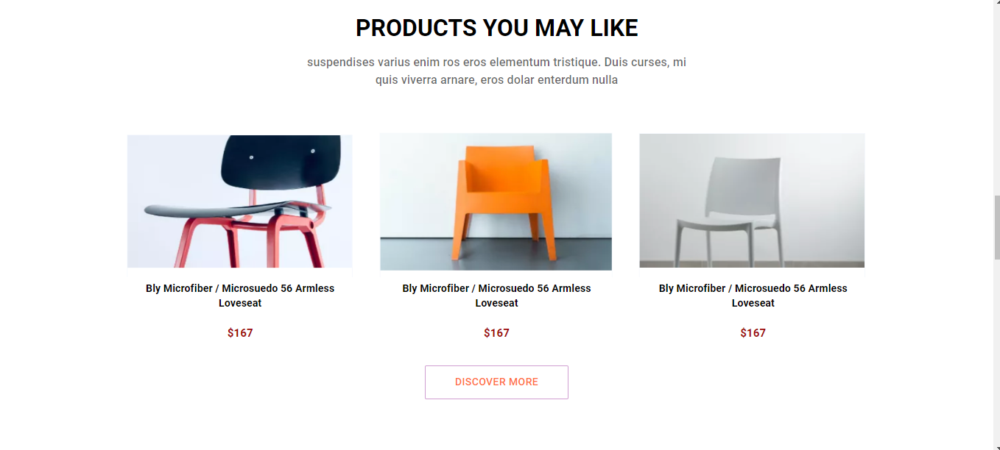

# Furniture Website

## Poject Desrciption:

Furniture Website is a single page Application made of using Javascript's very popular library React-js. using Material-UI. It have a Navbar at the top of application which have links to route on different pages(you can route on product, About, Page, Blog, Contact, MyAccount). it contains clickable buttons , different sections to explore and having many products to explore by clicking on particular product you can view product details.

## Technology Used:
- React JS : React JS is a Javascript library used to develop the application.
- Material-UI : Some Material-UI components like Icons, Grid, Tabs, Badge, Typography , MakeStyle, Stack , Button, Styled, Paper, Box, TabContext, TabList, Tabpanel is Used.
- Javascript :
- JSX : Javascript XML is used to structure the page.
- Material CSS : MUI makestyle is used to style the page and make it more beutiful and attractive.
- Basic CSS: used to provide basic comfortability to website.

## What I've Learnt :
- Class and functional componets and their difference.
- How to manage directories and file structure.
- How to create components.
- About some material-UI components and how to used them.
- How to apply material CSS using makestyle in same js files.
- Setup of  React-js, material-UI installation.
- Setup ES Lint and identifying its error and resolving them.
- writing clean and structure code.
- How to use props.
- include useParams.
- implementation of filter & Map function.
- React Routing with link , path, params etc.
- how to use useState, UseEffect, onClick event handling, Button toggle etc.
- How to fetch data from API.

## API
- In this project whatever data is used it is fetched from API url which was hosted on localserver.
- So first need to run localserver because API is not hosted globally it was present locally.
- Run project(furniture websiteAPI) available on github.URL for it: https://github.com/ShiRitika/furniture-websiteAPI

### About Furniture-websiteAPI
- it include mongoDB database to store data in form of collection.
- with the help of postman i had get and post data on mongoDB and get URL to fetch data.
- Mongoose are used to define schema and models for database.

## Getting Started with Create React App

This project was bootstrapped with [Create React App](https://github.com/facebook/create-react-app).

### `npm start`

Runs the app in the development mode.\
Open [http://localhost:3000](http://localhost:3000) to view it in your browser.

The page will reload when you make changes.\
You may also see any lint errors in the console.

### Home - Page

Header part

- In navbar section Routing is active you can route on any page.
- Discover More button is clickable.

Popular Products part

- You can explore any products by clicking on(Sofa, Table, Chair, Bed, Lightning, Decore).
- Here product details are available. To explore it click on any image it will navigate you to product details page.

Best Manufacturer Part

Product you may like part

- Discover More Button is Clickable here.

Insipred social-media part

Top Pick part

Footer part

- if you click on any link in footer part it will navigate you on page404 error page.

### Product - Page

- When you click on any nav links like(product, About.......) it will Route to a New Page.(New pages right now not available pon working).

### Product Details - Page
- when you click on any image on product on popular product section it will render Product Detail page .

Product Detail- header part

Product Detail- Buy Product part

- In this section when you click on any image wrapped in small boxes.it will open on big box.(it will help you to explore more images of same product).

Product Detail- Review part

Product Detail- Footer part

